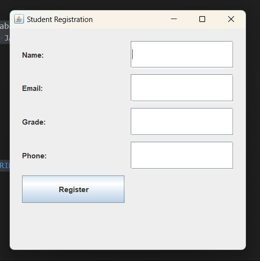
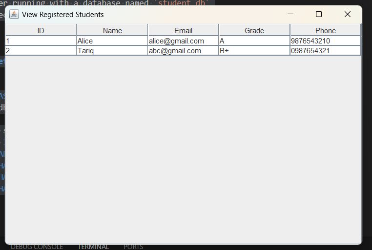

 **Project Overview:**
A Java Swing application to register students and view their details, connected to a MySQL database.

---

**Prerequisites:**

* Java JDK installed
* MySQL Server running with a database named `student_db`
* MySQL Connector/J version 9.3.0 JAR file added to `lib/` folder

---

**Database Setup:**

```sql
CREATE DATABASE student_db;
USE student_db;

CREATE TABLE student (
  student_id INT AUTO_INCREMENT PRIMARY KEY,
  name VARCHAR(100),
  email VARCHAR(100),
  grade VARCHAR(10),
  phone VARCHAR(15)
);
```

---

**Project Structure:**

```
StudentManagementSystem/
├── src/
│   ├── model/
│   ├── dao/
│   ├── ui/
│   └── main/
├── lib/
│   └── mysql-connector-j-9.3.0.jar
├── out/
```

---

**Compile the project:**

```bash
javac -cp "lib/mysql-connector-j-9.3.0.jar" -d out src/model/*.java src/dao/*.java src/ui/*.java
```

---

**Run the Student Registration UI:**

```bash
java -cp "out;lib/mysql-connector-j-9.3.0.jar" ui.StudentUI
```

---

**Run the View Registered Students UI:**

```bash
java -cp "out;lib/mysql-connector-j-9.3.0.jar" ui.ViewStudentsUI
```

> *Note:* On Linux/macOS, replace the semicolon (`;`) with a colon (`:`) in the classpath.

---

## Output Screenshots

### 1. Student Registered Successfully

After filling out the registration form and submitting, the console shows:



---

### 2. View Registered Students

All registered students are displayed in a table UI:



---

**Additional Notes:**

* Make sure your database connection (username/password) is correct in your `DBConnection` class.
* MySQL server should be running and accessible at `localhost:3306`.

---

**Support:**
For any questions or issues, please contact \[Tarique Ahsan] at \[[tariq.ahsan.1619@gmail.com](mailto:tariq.ahsan.1619@gmail.com)].